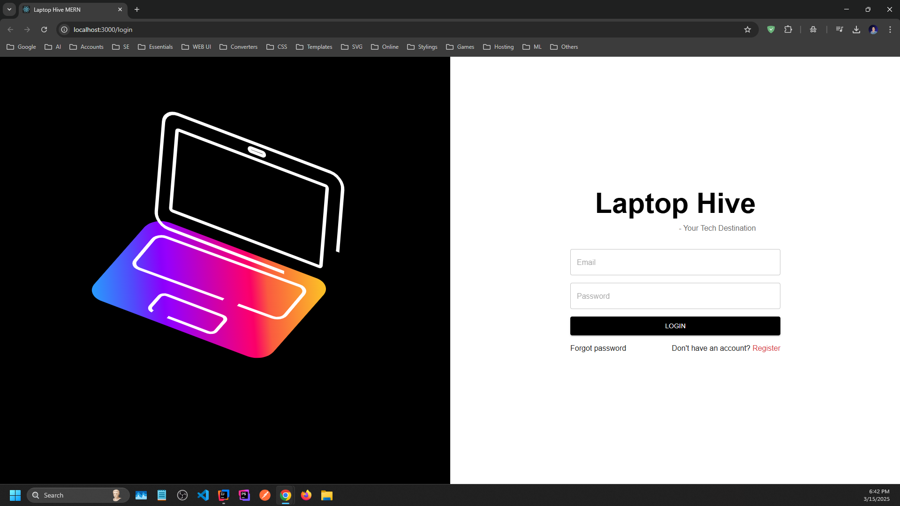
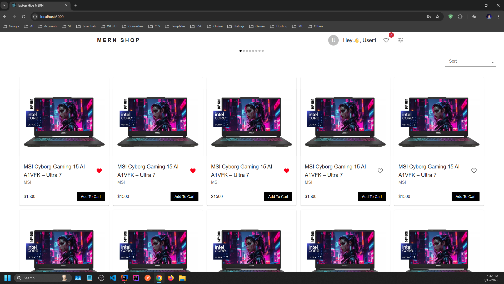
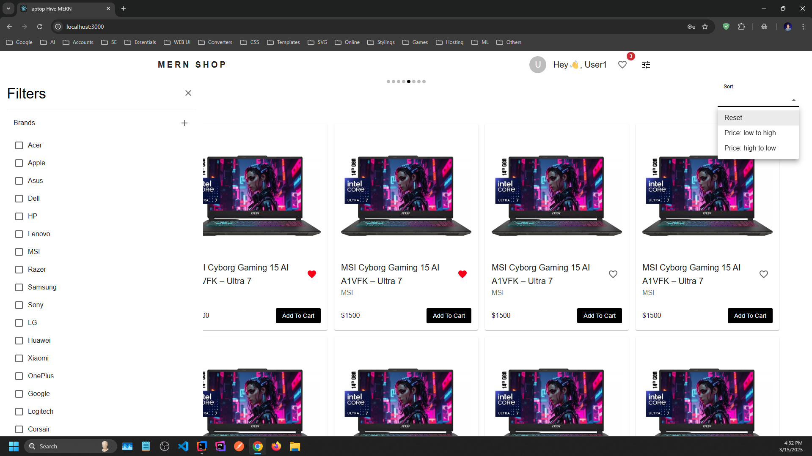
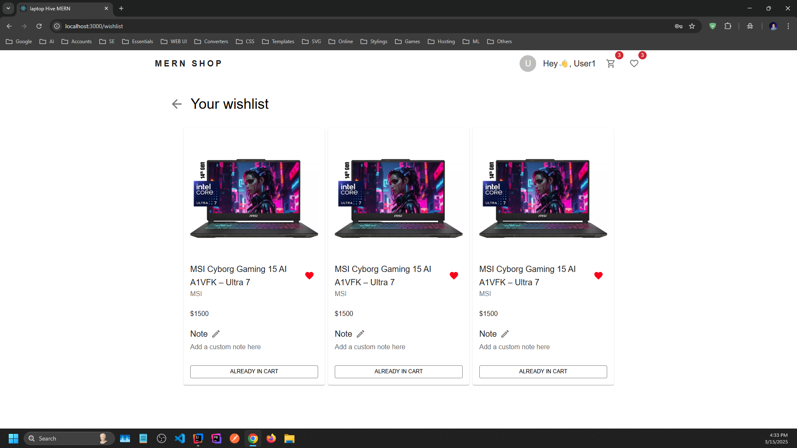
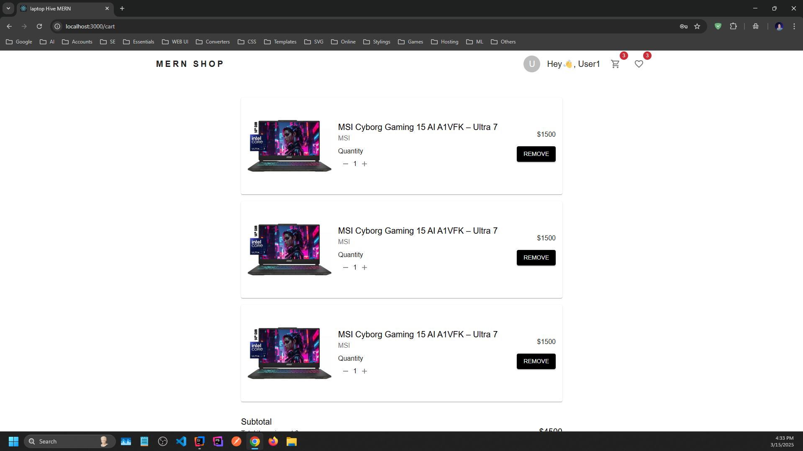
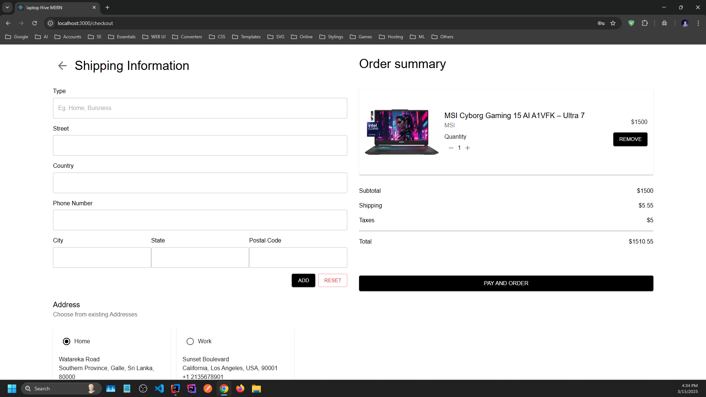
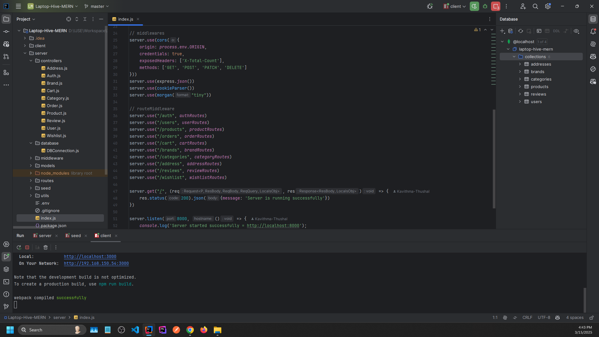

# 💻 Laptop Hive MERN 💻

**Laptop Hive MERN** is a full-stack application designed to transform your online shopping experience. Built with the
MERN stack (MongoDB, Express.js, React, Node.js), it leverages Redux Toolkit for efficient state management and Material
UI for a sleek, user-friendly interface. This project offers a robust platform for both users and admins, packed with
essential features for a seamless experience.

## 🛠️ Tech Stack

### Frontend

✅ React<br/>
✅ Redux<br/>
✅ Material UI<br/>

### Backend

✅ Node.js<br/>
✅ Express.js<br/>
✅ MongoDB<br/>

## 🚀 Key Features

### ✅ Admin

- **Product Management:**
    - Add, edit, delete, and soft-delete products.
    - Manage product attributes like name and stock.

- **Order Management:**
    - View and update order details and status.

### ✅ User

- **Product Reviews:**
    - Write, edit, and delete reviews.
    - Instant updates on ratings and star percentages.

- **Wishlist:**
    - Add, remove, and annotate products with personalized notes.

- **Order Management:**
    - Create new orders and view order history.

- **Profile Management:**
    - Manage email, username, and multiple addresses.

- **Shopping Cart:**
    - Add products, adjust quantities, and view subtotals.

### ✅ Security

- **Secure Authentication:**
    - Login, signup, OTP verification, password reset, and logout.

## 📧 How to use

### ✅ Frontend

- Create a `.env` file in the client directory
- Add the following variable:

```bash
# Backend URL
REACT_APP_BASE_URL="http://localhost:8000" 
```

### ✅ Backend

- Create a `.env` file in the server directory.
- Add the following variables with appropriate values

```bash
# Database Connection
MONGO_URI="mongodb://localhost:27017/your-database-name"

# Frontend URL
ORIGIN="http://localhost:3000"

# Email credentials
EMAIL="your-email@example.com"
PASSWORD="your-email-password"

# Token and cookie expiration settings
LOGIN_TOKEN_EXPIRATION="30d"          # Days
OTP_EXPIRATION_TIME="120000"          # Milliseconds
PASSWORD_RESET_TOKEN_EXPIRATION="2m"  # Minutes
COOKIE_EXPIRATION_DAYS="30"           # Days

# Secret key for jwt security
SECRET_KEY="your-secret-key"

# Environment (production/development)
PRODUCTION="false"
```

### ✅ Accessing the Application

Once both servers are running, you can access them at the following URL's:

- Frontend: http://localhost:3000
- Backend: http://localhost:8000

### ✅ Admin Account

```bash
  email: admin@gmail.com
  pass: Admin12345
```

### ✅ User Accounts

```bash
  email: user1@gmail.com
  pass: User12345
```

```bash
  email: user2@gmail.com
  pass: User12345
```

```bash
  email: user3@gmail.com
  pass: User12345
```

```bash
  email: user4@gmail.com
  pass: User12345
```

```bash
  email: user5@gmail.com
  pass: User12345
```

## 📸 Screenshots

### Login



### Admin Panel


### Manage Products


### Manage Orders


### User Panel


### Manage Profile


### Products



### Filters



### Wishlist



### Cart



### Purchase



### View Order History


### Codes



## 📝 Version

**1.0.0**

## 📬 Get in Touch

If you encounter any issues, have questions, or need assistance with the code, feel free to reach out!

📧 [kavithmathushal9007@gmail.com](mailto:kavithmathushal9007@gmail.com)

<div align="center">

#### This project is licensed under the [GNU License](LICENSE)

#### © 2025 All Rights Reserved | Designed by [Kavithma Thushal](https://github.com/Kavithma-Thushal)

</div>